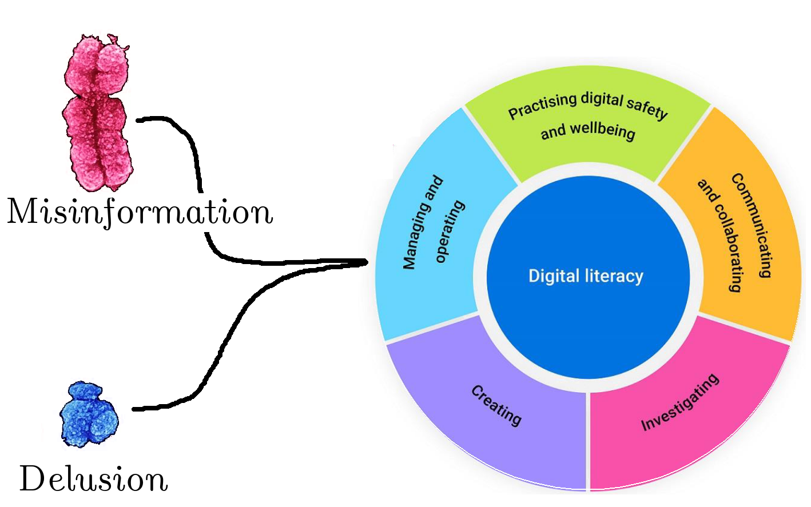

<html>
    <head>
        
      </head>
<body>
      <!-- Main hero unit for a primary marketing message or call to action -->

 
Who do the standards serve?

 
The students? Of course not.

  
<a href="/index" class="btn btn-primary btn-large">Return Home</a>

<h2>The Origin of the Standards</h2>

The conception of the standards is best understood as a <strong>satanic coupling</strong> with idealtic/delusional ACARA bureaucrats contributing the Y-chromosome (few genes, little information, pure endocrine action) and systematic, self-serving myths built by silicon valley contributing the X-chromosome (1,000 genes, information-rich, acts by producing).

 

 

 
<h2>Myth 1: Digital Wellbeing</h2>
<ol>
<li>Digital Wellbeing is a concept that was invented by Google</li>
<li>Young people's mental health is worse than ever before</li>
<li>Social media is well known to make young people's mental health worse</li>
<li>Silicon Valley's profits are tied to the amount of time people spend on their device</li>
</ol>

It is in big tech's interests that students are taught that 'self-regulation' is the key to 'digital wellbeing'. This is the same narrative as car manufacturers used to resist (spending money on) crash safety features in the 1950s.

This is the equivalent to telling an antelope that self-regulation is the key to avoiding the predation of the lion.

<h2>Myth 2: Privacy</h2>

Big Tech companies, as well as the State, can freely monitor digital technology use by citizens. This includes browsing activity, message content, and purchasing decisions. The knowledge that you are accessing is known both to ASIO and to Facebook's marketing and neuro-manipulation departments. Privacy, therefore, is impossible. The standards "teach" students to manage their privacy online to perpetuate the myth that privacy is possible.

<h2>The Goal of the Standards</h2>

The immediate goal of the standards is to train passive consumers of digital technology. These consumers play a vital role in creating shareholder value for transnational technology standards. This is reflected in the following standards:

<ul>
<li><strong>Digital Safety and Wellbeing</strong>. Particularly "creating and curating their online identities to positively tell their stories".</li>
<li><strong>Communicating and Collaborating</strong>. These activities are moved online where they can be monetised and monitored.</li>
</ul>

The secondary goal of the standards is to train digital serfs. Digital serfs produce content for the landlords of the digital space in which they live. This is the canonical feature of web 2.0: Consumers rent space and produce content in that space. This is reflected in the following standards:

<ul>
<li><strong>Creating</strong>. Particuarly 'create content' and 'respect intellectual property'. Intellectual property is important to prevent monetisable content being used in ways which are less efficient to extract shareholder value from.</li>
<li><strong>Managing and Operating.</strong> Particuarly managing content. Students are encouraged to use the Cloud - a storage format that maximises ease of surveillance and ensures that personal data such as photos are held hostage by silicon valley, which can then charge subscription fees in exchange for access to one's own history and memories.</li>
</ul>

&nbsp;

&nbsp;

</body>
</html>
<!-- Comments are visible in the HTML source only -->